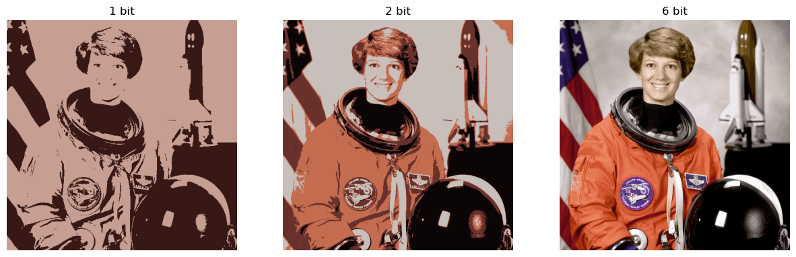

# Image Compression with K-Means Clustering

A 24-bit RGB image uses $256 = 2^8$ possible values per colour-channel (Red/Green/Blue), so that, each pixel in the image requires $3\times 8 = 24$ bits of storage.
We would like to approximate such an image with an $n$-bit RGB image using K-Means clustering, where $n < 24$.
    

*Figure 1: Image before compression*

 

*Figure 2: Image after compression*

